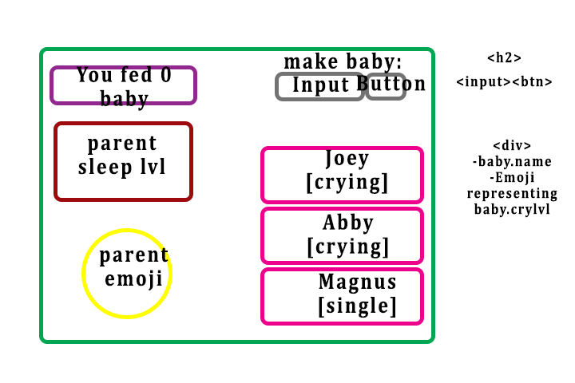

# Crying Baby

Acceptance Criteria

-   On load, see the HP and names of at least two default babies
-   On submitting the 'have a baby' form, add a new baby object (with 3 HP and a name) to state and display it to the DOM
-   On clicking a baby, it should tell the user whether they fed the baby or not, then update state and DOM appropriately with new HP
-   On clicking a baby, it should tell the user whether the parent lost sleep the player or not, then update state and DOM appropriately with new sleep level
-   Render fed babies differently, and disable clicking on them when fed
-   When the user's HP is 0, launch a game over message
-   Baby click handler
-                   Uses Math.random() function to determine amount fed
-                   Alerts user whether they fed the baby or not and updates HP
-                   Alerts user whether the parent lost sleep or not and updates HP
-   Show number of fed babies
-   Display babies differently and disable clicking when defeated
-   Disable all functionality when the game is over
-   Functions
-                   PURE: `renderBabies(baby)` : return DOM node`
-                   IMPURE: `displayBabies()` : clears DOM and appends baby data to baby list DOM node`

## HTML

Form

-   h2
-   input, button

baby \

-   baby.name, emoji = hungerlvl 😭=3 😢=2 🥺=1 👶=0

Scoreboard \

-   \
 You have fed ${babiesFed} babies.

Parent sleep level \

-   \
 Your sleep lvl: 10

Parent Emoji \
 Parent Emoji
